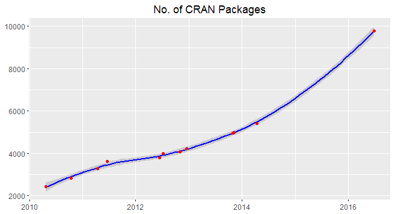
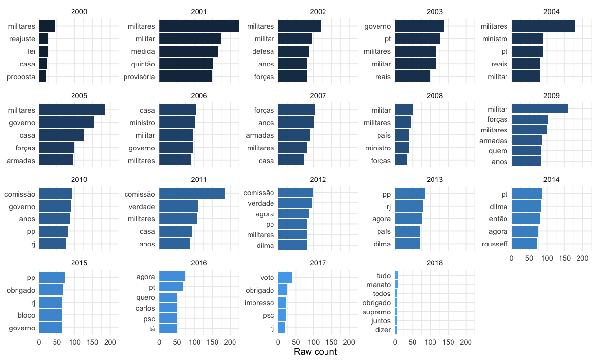

```{r setup, include=FALSE}
library(ggplot2)
library(magrittr)
library(knitr)
library(dplyr)
library(stringr)
library(tibble)
library(tidytext)
library(kableExtra)
theme_set(theme_minimal(14))
options(htmltools.dir.version = FALSE)
```


# O que é o `{speechbr}`?

Uma ferramenta na linguagem de programação R que acessa os textos dos discursos de deputados e deputadas da Câmara Federal (aprendi com vocês EPEP), junto com informações de quem fez o discurso e da sessão na Câmara. Mais detalhes depois.

.pull-left[


]

.pull-right[


]

---
# Por que em R?

* No geral, só porque eu gosto mais mesmo.
* Atingir um público específico, cientistas sociais e jornalistas de dados, que trabalham mais com R do que com Python, por exemplo.


---

# O que é um pacote?

* Ideia de agrupar e manter funções criadas por você, em um "ambiente" só

* Compartilhar esse ambiente com outras pessoas, permitindo que elas utilizem da mesma forma que você as utiliza localmente

* É muito complicado pensar que se você quer criar algo novo na linguagem (R) tu precisaria fazer mudanças na base

* Acelera o desenvolvimento da ferramenta (Open Source)

.center[



]
---
class: middle, center

# Voltando ao `{speechbr}`?

Simula uma pesquisa no próprio [site](https://www2.camara.leg.br/atividade-legislativa/discursos-e-notas-taquigraficas) de Banco de Discursos da Câmara dos Deputados

## Vamos ver na prática!

.center[


]

---

# Baixando o pacote

* O pacote está no [CRAN](https://cran.r-project.org/web/packages/speechbr/index.html), o que significa você poder baixá-lo utilizando funções nativas do R. 

* CRAN é o principal repositório de pacotes em R, a principal vantagem é conseguir baixá-lo facilmente com `install.packages` e o pacote é testado diariamente em diferentes sistemas.

```{r cran, echo=TRUE, eval=FALSE}
# instalar o pacote
install.packages("speechbr")
```

* O que está no CRAN é a versão 1.0.0. Caso você queira acessar o pacote em desenvolvimento, precisa baixá-lo do GitHub, onde fica hospedado os códigos.

```{r devtools, echo=TRUE, eval=FALSE}
install.packages("devtools")

devtools::install_github("dcardosos/speechbr")
```

---

# Argumentos

* O pacote possui apenas uma função (pública e disponível), `speech_data`, que recebe os seguintes argumentos:

```{r params, echo=FALSE}

tibble(
  args = c("keyword", "start_date", "end_date", "speaker", "party", "uf"),
  description = c("palavra ou frase a ser presquisada",
                  "data de início da pesquisa",
                  "data de fim da pesquisa",
                  "orador do discurso",
                  "partido do orador",
                  "estado do orador"), 
  mandatory = c(TRUE, TRUE, TRUE, FALSE, FALSE, FALSE)) %>% 
  kable()

```

---

# E vamos as consultas
```{r consulta1, eval=FALSE, echo=TRUE}
library(speechbr)
speech_data(keyword = "aborto", start_date = "2021-05-01", end_date = "2021-06-30")
```

```{r aborto_csv, echo = FALSE, message=FALSE}
readr::read_csv("data/aborto.csv") %>% 
  mutate(discurso = str_sub(discurso, 88, 140)) %>% 
  kable(table.attr = "style='width:40%;'") %>% 
  kable_styling(font_size = 10)
```

Você pode filtrar ainda mais os resultados utilizando dos outros argumentos, que são opcionais. Para saber mais sobre os argumentos, você pode acessar a documentação com `?speech_data`.

---

# Tá, mas e agora?

Existem inúmeras possibilidades do que fazer com os dados, principalmente envolvendo algo chamado Processamento de Linguagem Natural, que abrange termos como:

- Análise de sentimento
- Modelagem de tópicos
- Summary writer
- Classificação de textos
- Reconhecimento de textos similares
- Outros
---
class: middle, center

# Topic modelling

Modelos de aprendizado de máquina que identifica tópicos em uma coleção de documentos, descobre estruturas semânticas escondidas. Primeiro, vamos ver as palavras mais usadas em uma base de dados que extrai anteriormente sobre desigualdade.

## Palavras mais utilizadas

```{r desigualdade_csv, echo = FALSE, message=FALSE}
bolso <- readr::read_csv("data/bozo.csv") 

stopwords <- tidytext::get_stopwords("pt") %>% 
  bind_rows(
    tibble(
      word = c("é", "sr", "presidente", "ser", "aqui", "deputado", "deputados", "brasil", "vai", "fazer", "sobre", "porque", "jair",
               "bolsonaro", "ter", "neste", "v.exa", "orador",
               "revisão"),
      lexicon = "snowball"))

tidy_bolso <- bolso %>%
  rowid_to_column("document") %>% 
  unnest_tokens(word, discurso) %>% 
  anti_join(stopwords) 

tidy_bolso %>% 
  count(word, sort = TRUE) %>% 
  slice_max(order_by = n, n = 20) %>% 
  kbl() %>% 
  kable_styling() %>% 
  scroll_box(height = "400px", width = "800px")
```

---
class: middle, center

# Modelo

```{r modelo, echo=FALSE}
bolso_sparse <- 
  tidy_bolso %>% 
  count(document, word) %>% 
  cast_sparse(document, word, n)

topic_model <- stm::stm(bolso_sparse, K = 4, verbose = FALSE)

#summary(topic_model)

word_topics <- tidy(topic_model, matrix = "beta")

word_topics %>%
  group_by(topic) %>%
  slice_max(beta, n = 10) %>%
  ungroup() %>%
  mutate(topic = paste("Topic", topic)) %>%
  ggplot(aes(beta, reorder_within(term, beta, topic), fill = topic)) +
  geom_col(show.legend = FALSE) +
  facet_wrap(vars(topic), scales = "free_y") +
  scale_x_continuous(expand = c(0, 0)) +
  scale_y_reordered() +
  labs(x = expression(beta), y = NULL)
```
---
class: middle, center
## Análise por ano

```{r count_per_year, echo=FALSE, eval=FALSE}

tidy_bolso %>% 
  mutate(ano = lubridate::year(data)) %>% 
  group_by(ano) %>% 
  count(word) %>% 
  slice_max(order_by = n, n = 5) %>% 
  ungroup() %>% 
  ggplot(aes(n, reorder_within(word, n, ano), fill = ano)) +
  geom_col(show.legend = FALSE) +
  facet_wrap(vars(ano), scales = "free_y") +
  scale_y_reordered() +
  scale_x_continuous(expand = c(0, 0)) +
  labs(x = "Raw count", y = NULL)
```


---
class: center, inverse

# Finalização

Use o pacote se puder! É com uso que eu irei poder melhorá-lo, ainda tem muita coisa que pode ser melhorada, e você pode contribuir!!! A tecnologia só está desse jeito hoje porque lá atrás as pessoas abriram seus códigos ao mundo e outros colaboraram.

.center[

]